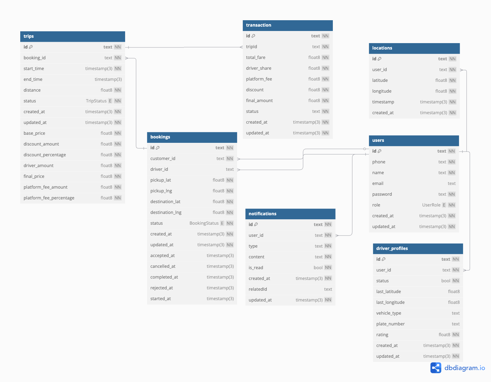

# 🚀 NebengJek – Backend System

NebengJek adalah sistem backend untuk layanan ojek online yang inovatif, menggabungkan konsep transportasi dan aplikasi kencan. Sistem ini dirancang khusus untuk ekosistem Telkomsel dengan pendekatan yang ringan, sederhana, dan cepat. NebengJek menggunakan lokasi Telkomsel untuk mendeteksi posisi pengguna dan menghubungkan dengan ojek terdekat dalam radius 1 kilometer.

# 🏗️ Teknologi & Tools

| Kategori                 | Teknologi                                                            | Alasan Pemilihan                                                                    |
| ------------------------ | -------------------------------------------------------------------- | ----------------------------------------------------------------------------------- |
| **Kerangka Kerja**       | NestJS (TypeScript)                                                  | Arsitektur modular, dependency injection bawaan, dukungan TypeScript yang excellent |
| **Arsitektur**           | Microservices dalam Monorepo                                         | Kemudahan pemeliharaan tinggi, perpustakaan bersama, deployment mudah               |
| **Basis Data**           | PostgreSQL + Redis                                                   | PostgreSQL untuk konsistensi data, Redis untuk lokasi real-time & caching           |
| **Komunikasi Real-time** | WebSocket (NestJS Gateway)                                           | Latensi rendah untuk pelacakan lokasi dan notifikasi                                |
| **Antrian Pesan**        | Redis Pub/Sub                                                        | Arsitektur event-driven untuk komunikasi antar layanan                              |
| **Autentikasi**          | JWT + Refresh Token                                                  | Autentikasi stateless dengan praktik keamanan terbaik                               |
| **Kontainerisasi**       | Docker + Docker Compose                                              | Konsistensi lingkungan dan deployment mudah                                         |
| **ORM**                  | Prisma                                                               | Akses basis data yang type-safe, manajemen migrasi                                  |
| **Pengujian**            | Jest + Supertest                                                     | Unit testing dan end-to-end testing                                                 |
| **Infrastruktur Cloud**  | AWS (CloudFormation)                                                 | Skalabel, layanan terkelola                                                         |
| **Protokol Komunikasi**  | TCP untuk antar-layanan, WebSocket untuk real-time, REST untuk klien | Pola komunikasi yang dioptimalkan                                                   |

# 📂 Struktur Monorepo

```bash
📦nebengjek/
├── 📂apps/ # Microservices
│ ├── 📂user-service/ # Autentikasi, manajemen pengguna & pengemudi
│ ├── 📂booking-service/ # Manajemen siklus hidup booking
│ ├── 📂matching-service/ # Algoritma pencocokan pengemudi-pelanggan
│ ├── 📂tracking-service/ # Lokasi real-time & pelacakan perjalanan
│ ├── 📂payment-service/ # Kalkulasi & pemrosesan pembayaran
│ └── 📂notification-service/ # Notifikasi WebSocket & penanganan event
├── 📂libs/ # Perpustakaan Bersama
│ ├── 📂common/ # Entity, DTO, guard, decorator bersama
│ ├── 📂database/ # Modul Prisma & Redis
│ └── 📂messaging/ # Utilitas pesan event-driven
├── 📂deployment/ # Infrastructure as Code
│ ├── 📂docker/ # Dockerfile untuk setiap layanan
│ └── 📂cloudformation/ # Template infrastruktur AWS
├── 📂prisma/ # Skema basis data & migrasi
└── 📂docs/ # Dokumentasi & diagram
```

# 🔐 Password Hashing

- Menggunakan `bcrypt` untuk keamanan
- Salt rounds: 10 (default)
- Digunakan untuk pengamanan akun user & driver

# 🧩 Komponen Utama

1. Layanan Pengguna 🔐

Fungsi: Autentikasi, registrasi pengguna, manajemen profil
Fitur: Autentikasi berbasis JWT, akses berbasis peran (CUSTOMER/DRIVER), manajemen profil pengemudi
Basis Data: Entity User, DriverProfile
API: Endpoint REST untuk autentikasi dan manajemen profil

2. Layanan Booking 📋

Fungsi: Manajemen siklus hidup booking dari pembuatan hingga penyelesaian
Fitur: Buat booking, pembaruan status, penanganan pembatalan
Integrasi: Komunikasi TCP dengan layanan matching untuk pencarian pengemudi
Basis Data: Entity Booking dengan pelacakan timestamp status
Event: Publikasi event booking untuk layanan notifikasi

3. Layanan Matching 🎯

Fungsi: Algoritma pencarian pengemudi terdekat dalam radius 1km
Fitur: Kalkulasi geospasial, pemeriksaan ketersediaan pengemudi, optimisasi pencocokan
Sumber Data: Redis untuk lokasi pengemudi real-time
Komunikasi: Konsumsi event booking, respons TCP ke layanan booking
Algoritma: Formula Haversine untuk kalkulasi jarak

4. Layanan Pelacakan 📍

Fungsi: Pelacakan lokasi real-time dan manajemen perjalanan
Fitur: Pembaruan lokasi, mulai/selesai perjalanan, kalkulasi jarak, kalkulasi biaya
Real-time: WebSocket untuk siaran lokasi
Integrasi: Komunikasi TCP dengan layanan pembayaran untuk penagihan
Basis Data: Entity Trip, Location dengan indeks geospasial

5. Layanan Pembayaran 💰

Fungsi: Kalkulasi tarif, pemrosesan pembayaran, pembagian pendapatan
Fitur: Harga dinamis (3.000 IDR/km), opsi diskon pengemudi, biaya platform (5%)
Integrasi: Komunikasi TCP dengan layanan pelacakan
Basis Data: Entity Transaction untuk catatan keuangan
Logika Bisnis: Kalkulasi biaya platform, optimisasi pendapatan pengemudi

6. Layanan Notifikasi 🔔

Fungsi: Notifikasi real-time dan manajemen WebSocket
Fitur: Notifikasi multi-channel, pesan event-driven, siaran WebSocket
Penangan Event: Event booking, event pencarian pengemudi, event perjalanan
Komunikasi: Gateway WebSocket untuk komunikasi klien real-time
Basis Data: Entity Notification untuk pesan persisten

# 🗺️ High-Level Design


# 🗺️ Low-Level Design


# 🔍 ERD (Entity Relationship Diagram)

Entity yang dirancang:

- User: Autentikasi Pelanggan & Pengemudi
- DriverProfile: Data khusus pengemudi (status, lokasi, kendaraan)
- Booking: Permintaan perjalanan dengan siklus hidup status
- Trip: Perjalanan aktif dengan pelacakan jarak & biaya
- Transaction: Catatan pembayaran dengan pembagian pendapatan
- Location: Riwayat posisi real-time
- Notification: Pesan multi-channel



# 🚀 Alur Bisnis NebengJek

1. Alur Pencarian & Pencocokan Pengemudi

   Pelanggan Buat Booking → Layanan Booking (REST)
   → Simpan ke PostgreSQL
   → Publikasi Pesan (Redis Pub/Sub)
   → Penangan Pencarian Pengemudi
   → Layanan Matching (TCP)
   → Cari Pengemudi dalam radius 1km
   → Notifikasi WebSocket ke Pelanggan & Pengemudi yang Eligible

2. Alur Penerimaan Booking

   Pengemudi Terima → Layanan Booking (REST)
   → Perbarui Status Booking (PostgreSQL)
   → Publikasi Event (Redis Pub/Sub)
   → Notifikasi WebSocket ke Pelanggan

3. Alur Eksekusi Perjalanan

   Pengemudi Mulai Perjalanan → Layanan Pelacakan (REST)
   → Inisialisasi Trip (PostgreSQL)
   → Publikasi Event → Notifikasi WebSocket ke Pelanggan
   → Pembaruan Lokasi Real-time (WebSocket)
   → Kalkulasi Jarak (setiap pembaruan lokasi)
   → Kalkulasi Biaya (3.000 IDR/km)

4. Alur Penyelesaian Perjalanan & Pembayaran

   Pengemudi Akhiri Perjalanan → Layanan Pelacakan (REST)
   → TCP ke Layanan Booking (Selesaikan Booking)
   → TCP ke Layanan Pembayaran (Proses Pembayaran)
   → Distribusi Pendapatan (Pengemudi 95%, Platform 5%)
   → Catatan Transaksi (PostgreSQL)

# ⚙️ Menjalankan Proyek

### Prasyarat

```bash
# Install dependensi
npm install

# Setup variabel lingkungan
cp .env.example .env
# Isi semua nilai yang diperlukan dalam .env
```

### Database

```bash
# Generate klien Prisma
npx prisma generate

# Jalankan migrasi (basis data baru)
npx prisma migrate dev

# Reset basis data (jika diperlukan)
npx prisma migrate reset

# Seeder data awal
npx prisma db seed
```

### Development

```bash
# Jalankan layanan tunggal
npm run start:user
npm run start:booking
npm run start:matching
npm run start:tracking
npm run start:payment
npm run start:notification

# Jalankan semua layanan dengan Docker
docker-compose up --build -d
```

# 🧪 End-to-End Testing (E2E)

Berikut ini beberapa skenario E2E yang akan diuji:
|Skema|Deskripsi|
|---|---|
|Register & Login|User dan Driver bisa register & auth|
|Booking Order|User buat booking|
|Matching Driver|Sistem cari driver tersedia|
|Accept Order|Driver menerima|
|Tracking|User melihat lokasi driver real-time|
|Complete Trip|Trip selesai dan status diupdate|

# 📌 Asumsi Proyek

- Lokasi dari Telkomsel disimulasikan menggunakan dummy koordinat
- Matching menggunakan perhitungan jarak sederhana (haversine/Euclidean)
- Transaksi real money tidak diimplementasikan
- Beberapa data disimpan sementara di Redis (misalnya lokasi driver)
- Event async diatur via RabbitMQ basic queue

# 🤝 Tim & Kontribusi

Disiapkan untuk keperluan assesment backend engineer 2025.
Ditulis dan dikembangkan secara mandiri.
